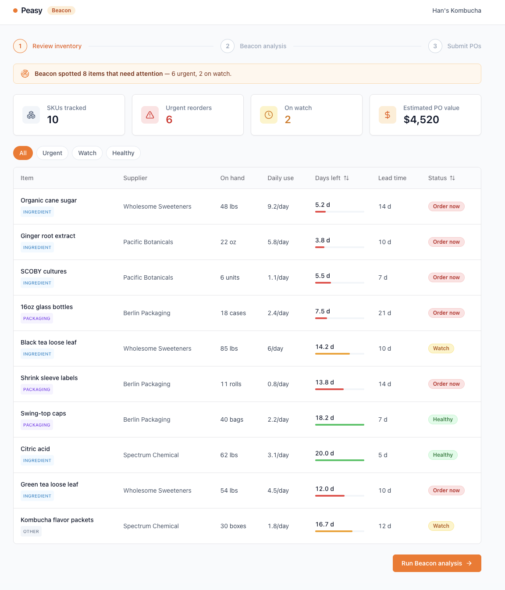
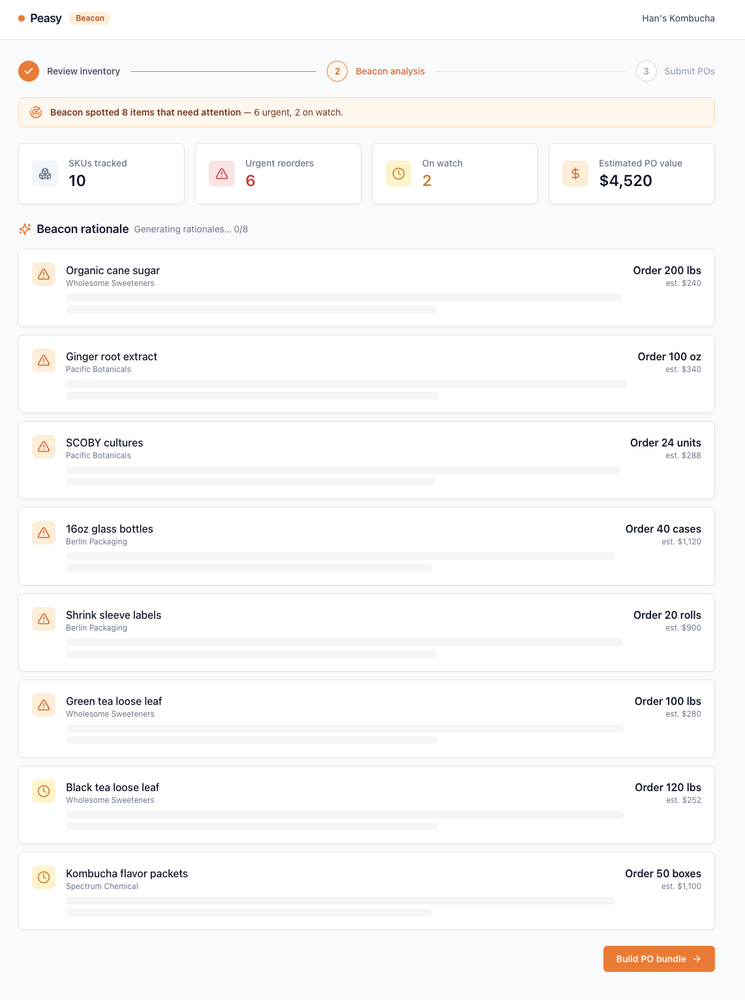
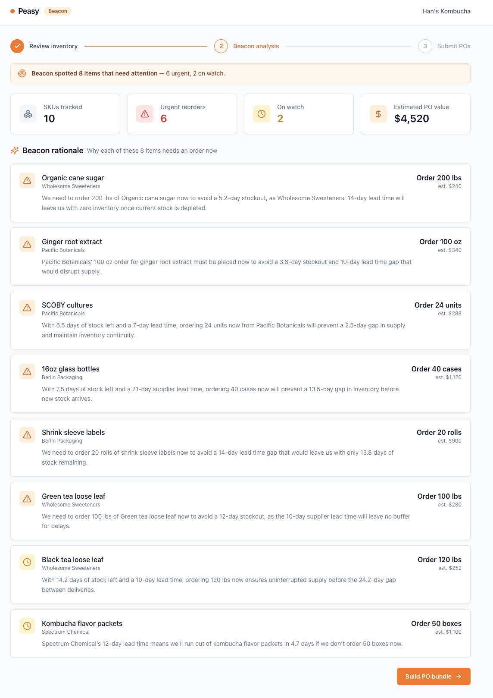
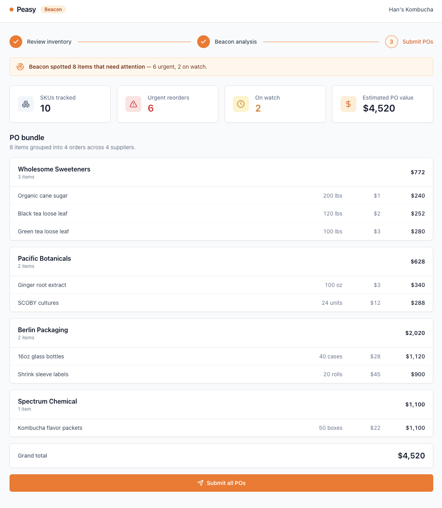
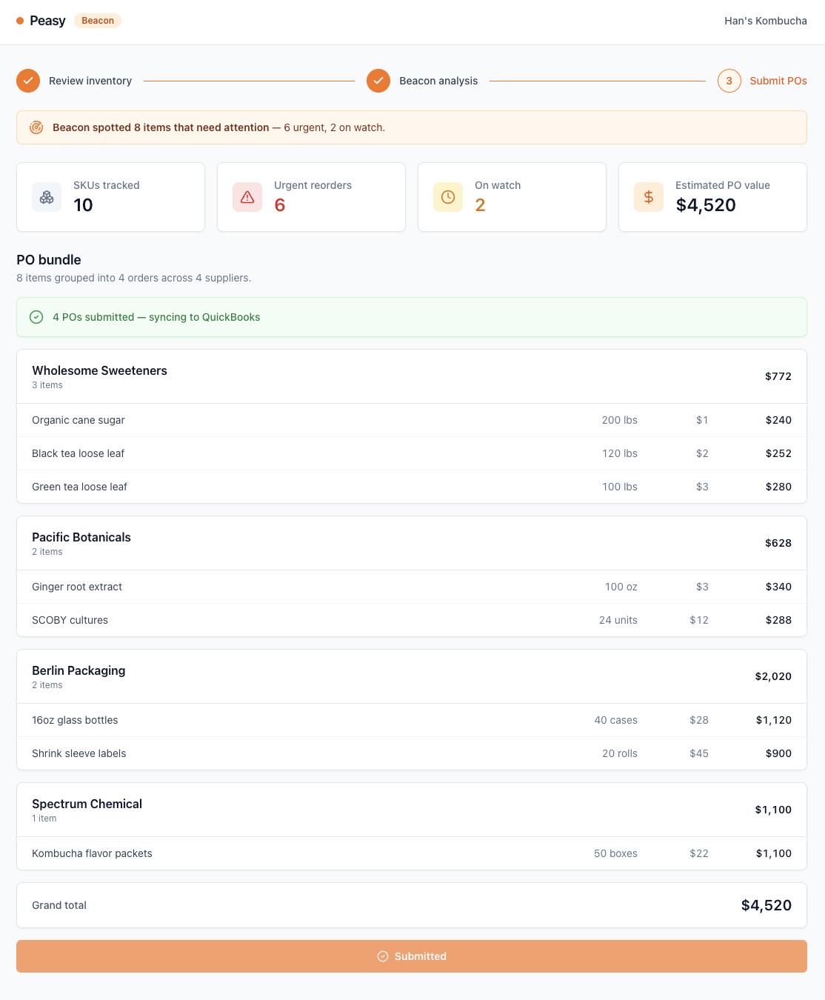

# Beacon by Peasy

CPG brands rarely run out of stock because they ran out of ingredients — they run out because they forgot to place an order fourteen days ago, while the supplier's lead time quietly ate the rest of their runway. Beacon closes that gap. It tracks days-of-stock-remaining for every SKU, then flags the ones whose remaining runway is shorter than their supplier's lead time plus a safety buffer: **urgent** when stock will run out within three days of the next possible delivery, **watch** when the cushion is shrinking. For Han's Kombucha, that means cane sugar with 5 days of cover and a 14-day lead time gets caught now — not after the line goes down. Beacon then groups every flagged item by supplier, drafts a complete purchase-order bundle, and lets the founder submit all of it in one click.

## Walkthrough

**1. Review inventory** — every SKU with days-of-stock-remaining and a colored runway bar; 8 of 10 items flagged (6 urgent, 2 on watch).



**2. Beacon analysis (generating)** — all flagged cards appear instantly with their reorder quantities; the AI rationale streams into each card as the local model finishes it.



**3. Beacon analysis (complete)** — one plain-English sentence per item explaining why it can't wait.



**4. PO bundle** — flagged items grouped into 4 purchase orders across 4 suppliers, $4,520 total, ready to send.



**5. Submitted** — one click sends every PO; success state confirms the (simulated) QuickBooks sync.



## How it works

The mental model matters here: **the model doesn't calculate the risk; TypeScript does.** Every number that drives a decision — days remaining (`onHand / dailyVelocity`), the urgency threshold (`daysRemaining <= leadTime + 3`), the PO subtotals, the supplier groupings — is computed by pure, fully-typed functions in `lib/reorder.ts` with no model in the loop. The LLM's only job is to translate those numbers into one compelling, founder-readable sentence about *why* an order can't wait. That's the right division of labor for an ops tool: deterministic math where correctness is non-negotiable, and a language model only where plain-English judgment actually adds value. The API route does zero arithmetic — it receives numbers the client already computed and asks the model to narrate them.

The stack mirrors what a real production CPG platform ships on. **Next.js 14 with the App Router** keeps the model call server-side in a route handler (`app/api/beacon/route.ts`), so the dashboard never talks to the model directly. **TanStack Table v8** powers the inventory grid with sortable columns, urgency-colored runway bars, and client-side filtering — the same library you'd reach for when the table needs to scale past a demo. **shadcn/ui** (Card, Badge, Button, Table, Separator, Skeleton) on Tailwind gives the surface a real-SaaS feel without a heavyweight component library, and the loading skeletons make the AI latency feel intentional rather than slow. Rationales are generated by a **local [Ollama](https://ollama.com) model** (`qwen3:8b` by default) — no API key, no data leaving the machine — fired in parallel via `Promise.all`, with a graceful per-item fallback so one failed call never sinks the bundle.

## Running locally

```bash
# 1. Start Ollama and pull the model.
#    NUM_PARALLEL=4 lets it generate up to 4 rationales concurrently — noticeably
#    snappier than the default, which serves the requests one at a time.
OLLAMA_NUM_PARALLEL=4 ollama serve   # if Ollama isn't already running
ollama pull qwen3:8b                 # one-time, ~5 GB

# 2. Start the app
npm install
cp .env.local.example .env.local   # optional — defaults already target local Ollama
npm run dev
```

Open [http://localhost:3000](http://localhost:3000) and walk the three steps: review the inventory table, run Beacon analysis to see the AI rationales, then build and submit the PO bundle.
